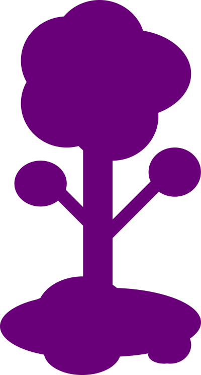

# Landing Page Espaço

 

	

 

Projeto criado para validação da capacitação de HTML, CSS e JavaScript
 da Beets JR.

O projeto consiste na implementação do [protótipo](./prototipo.pdf)
 feito na capacitação anterior de Figma & Design utilizando as três
 linguagens mencionadas. Foi sugerido que o protótipo fosse de um site
 com temática espacial, por tanto, escolhi como tema final o Espaço de
 [Terraria](https://terraria.org/) para criá-lo. Ainda que o tema
 seja sobre o jogo, nenhuma imagem utilizada foi retirada dele ou de
 alguma fonte relacionada a ele, apenas a ideia principal é sobre o
 jogo.
