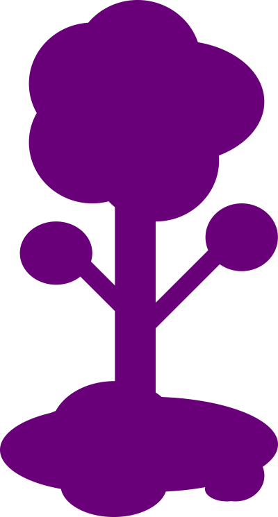

<h1 align="center">Landing Page Espaço</h1>

	
	  
	<h2>&#x1F680; Projeto criado para validação da capacitação de HTML, CSS e JavaScript da <a href="https://www.beetsjr.com.br/">Beets JR</a>.</h2>
	

		O projeto consiste na implementação do &#X1F320; <a href="./prototipo.pdf">protótipo</a> feito na capacitação anterior de Figma & Design utilizando as três linguagens mencionadas. Foi sugerido que o protótipo fosse de um site com temática espacial, por tanto, escolhi como tema final o Espaço de <a href="https://terraria.org/">Terraria</a> para criá-lo. Ainda que o tema seja sobre o jogo, nenhuma imagem utilizada foi retirada dele ou de alguma fonte relacionada a ele, apenas a ideia principal é sobre o jogo.
	

	 
	
Para acessar esse projeto finalizado e online, clique <a href="https://mutannejs.github.io/EspacoTerraria/" rel="next" target="_self">aqui</a>.

